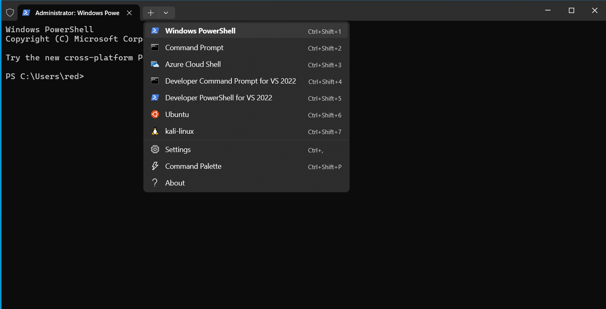
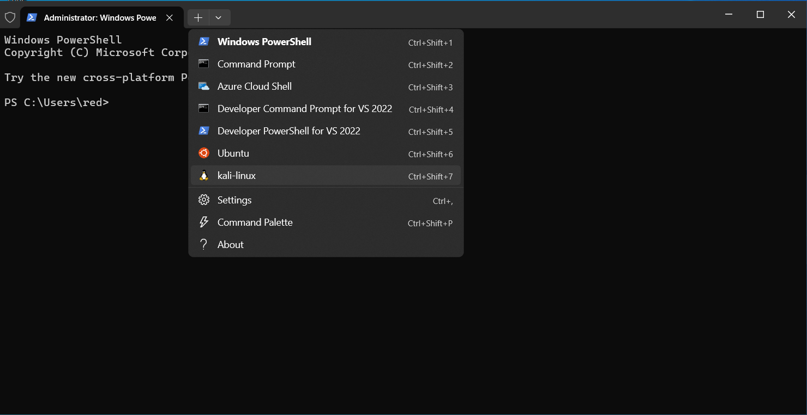

# WarmUp

Create a malware with msfvenom, execute it on the victim machine and investigate with built-in win tools
Let's start it.

First, open an Terminal window as Administrator (CTRL + Click)

Click Yes at the User the User Account Control Prompt.

Open a Kali linux command prompt: 

### step 1

### step 2

### step 3

### step 4
